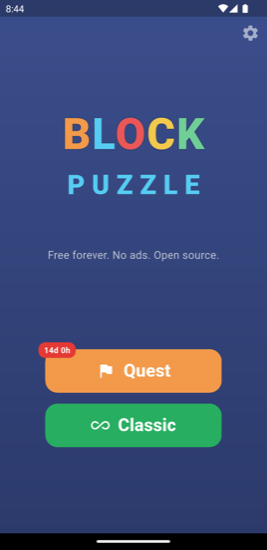
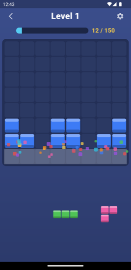
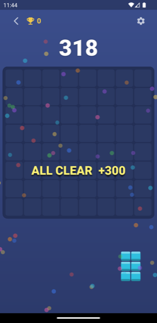
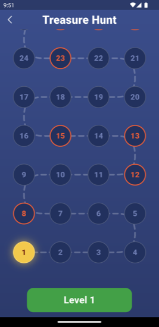
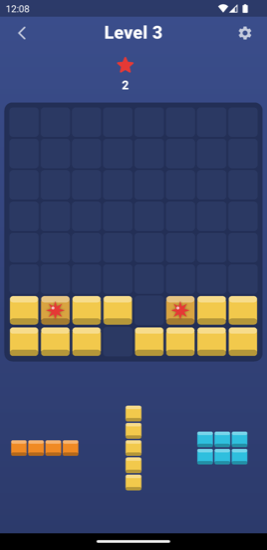

# Block Puzzle

[](https://github.com/fucad/block_puzzle/actions/workflows/ci.yml)

An open-source, ad-free block puzzle game (Block Blast style). Free
forever, on Android and iOS. Part of the
[Free Ad-free Games](PURPOSE.md) project: **zero extraction** — no
ads, no in-app purchases, no analytics, no dark patterns. Ever.

## Play

Drag pieces from the tray onto the 8×8 board. Fill a row or a column to
clear it. Chain clears for combos; empty the whole board for a big bonus.

- **Classic** — endless, chase your all-time high score.
- **Quest** — level map of hand-authored stages: reach a score or collect
  the gems, each starting from a crafted board layout. New quest packs go
  live straight from this repo, no app update needed.

## Screenshots

| Menu | Opening break | All clear! | Treasure hunt | Gem stage |
|:---:|:---:|:---:|:---:|:---:|
|  |  |  |  |  |

## For contributors

Everything is structured to be AI-assist friendly and reviewable:

| Where | What |
|-------|------|
| `lib/models/`, `lib/systems/` | Pure Dart game core — fully unit-tested, deterministic from a seed |
| `lib/game/` | Flame rendering layer (board, drag & drop, effects) |
| `lib/state/` | Riverpod state (settings, saves, quest progress) |
| `lib/services/` | Persistence, quest fetch/cache, audio |
| `lib/ui/` | Screens (one widget per file) |
| `content/quests/` | Quest packs — data-only contributions welcome! |

Start with [ARCHITECTURE.md](ARCHITECTURE.md). Author quest levels with
zero programming: [CONTRIBUTING_QUESTS.md](CONTRIBUTING_QUESTS.md).
Code contributions: [CONTRIBUTING.md](CONTRIBUTING.md). Progress and
decision history: [PROGRESS.md](PROGRESS.md).

```sh
flutter pub get
flutter test        # 60+ tests, all pure-logic rules covered
flutter run
```

Dev tools:
- `dart run tool/simulate.dart <seed> [moves]` — headless deterministic
  replay (add `--stage pack.json:id` for quest stages).
- `dart run tool/validate_quests.dart` — validate quest content.
- `python3 tool/generate_audio.py` — regenerate all sound effects.

## The only network call

The app fetches quest packs from this repository
(`raw.githubusercontent.com`) — that is its **only** network access.
Fully playable offline.

## License

Code: [MIT](LICENSE). Assets (including the synthesized audio): CC BY.
